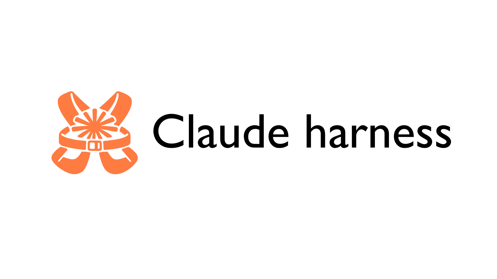
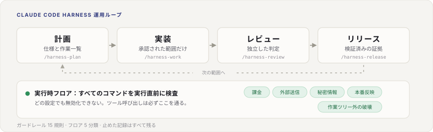

# Claude Code Harness

<p align="center">
  
</p>

<p align="center">
  <strong>Plan. Work. Review. Ship.</strong><br>
  <em>Claude Code / Codex CLI / Cursor / Grok の作業を、計画から出荷まで崩れにくくする。</em>
</p>

<p align="center">
  <a href="https://github.com/Chachamaru127/claude-code-harness/releases/latest"></a>
  <a href="LICENSE.md"></a>
  <a href="docs/CLAUDE_CODE_COMPATIBILITY.md"></a>
  
  
  
</p>

<p align="center">
  <a href="README.md">English</a> | 日本語
</p>

<p align="center">
  
</p>

## 何を解決するか

AI に任せた開発は、放っておくと崩れます。計画は会話に埋もれて消えます。締切が
近づくとテストが後回しになります。レビューはコードが入ったあとに始まります。
リリースの根拠は、毎回記憶からの再構成になります。

Harness は「AI に実装を頼む」を、繰り返せる 1 本の道に置き換えます。

**仕様を書く → 承認した範囲だけ実装する → 検証する → 別の目でレビューする →
根拠をまとめる。**

AI を賢くする道具ではありません。AI の周りにある**手順と境界**を固定します。
だからモデルが新しくなっても、仕組みはそのまま使えます。

> **この README の記述は機械で検査されています。** 書かれている部品が実際に
> 配線されているか、作業一覧の依存関係が矛盾していないか、配布バイナリが
> ソースから同じものを再生成できるかを、CI が確認します。検査を通った機能だけが
> ここに載ります。「書いた」は「動く」ではありません。

## 30 秒で導入

```bash
claude
/plugin marketplace add Chachamaru127/claude-code-harness
/plugin install claude-code-harness@claude-code-harness-marketplace
/harness-setup
```

そのあと、小さめの依頼を 1 つ渡してみてください。

```bash
/harness-plan README の導入手順をわかりやすくして
```

Harness が仕様（= 何が正しいかを決めた文書）と作業一覧（= やることを並べた表）
の下書きを作ります。**あなたの仕事は計画を書くことではありません。**
実行が進む前に、出てきた内容を承認するか直すことです。

別のツールを使っている場合は、後述の[ツール別の導入](#ツール別の導入)を見てください。

## 5 動詞のワークフロー

覚えるのは plan、work、review、sync、release の 5動詞スキルだけです。
この 5 つで回すのが 5動詞ワークフローです。
（`/harness-setup` は導入時に 1 回だけ実行します。）

| コマンド | 何が起きるか |
|---|---|
| `/harness-plan` | 依頼を仕様と作業一覧にする。範囲、完了条件、依存関係、未確定事項、停止条件を書く |
| `/harness-work` | 承認された作業を 1 件、または計画全体を実装する。必要な作業ではテストを先に書く |
| `/harness-work all` | 承認済みの計画をまとめて実行する。計画が固まり、リポジトリの状態が把握できてから使う |
| `/harness-review` | **実装とは切り離して**結果を見る。重大な指摘が残る限り完了にならない |
| `/harness-sync` | 計画と実際の実装を突き合わせて、ずれを報告する |
| `/harness-release` | 検証済みの根拠だけを、変更履歴とタグとリリースにまとめる |

各工程は、次の工程が必要とする材料を残します。

| 工程 | 成果物 | 通過条件 |
|---|---|---|
| 計画 | 仕様と作業一覧 | あなたが承認するか、直す |
| 実装 | コードとテスト | 作業がそう指定していればテストを先に書く |
| レビュー | 独立した判定 | 重大な指摘があれば完了できない |
| PR | 根拠一式 | PR が出せる状態と、リリースできる状態は別 |
| リリース | タグと配布物 | リリース前検査を通る |

AI が実際に見ていない情報は、勝手に埋めずに「未確認」のまま残します。

## 安全の仕組み

ここが、単なる指示テンプレートとの違いです。すべてのツール呼び出しは、
**実行される前に** Go 製の判定エンジンを通ります。あとから差分を見る方式では、
外部への送信や削除のような副作用を捉えられないためです。

**強さの違う 2 層**を重ねています。

| 層 | 決めること | 外せるか |
|---|---|---|
| **実行時フロア**（5 分類） | 拒否する | **外せない**。設定でも環境変数でも権限モードでも通らない |
| **ガードレール**（R01〜R15） | 拒否 / 確認 / 警告 | 一部はプロジェクト設定で変更できる |

フロアが見ているのは、課金、外部への送信、秘密ファイルの読み取り、本番反映、
そして作業ツリーの外を壊す操作です。設定から到達できない独立した経路に置いて
あるので、自律実行中の AI が理屈をこねて通り抜けることはできません。

ガードレールは調整する側の層です。`main` への直接 push、保護されたファイルへの
書き込み、強制 push、履歴の巻き戻しなど、それぞれに判定が決まっています。
プロジェクトの事情に合わせる余地はこちらにあります。

**確認は計画時に前倒しします。** 作業中に何度も聞くのではなく、その計画で必要に
なる危ない操作をまとめて先に承認します。承認には期限と対象作業と使用回数の上限
が付くので、一度の承認が恒久的な穴になりません。

**止めた事実は必ず残ります。** 規則名と分類と判定を 1 行ずつ記録します。
コマンドの文字列は書きません。ハッシュと長さだけで、秘密ファイル読み取りと課金の
分類ではそれすら省きます。「何に止められたか」を推測ではなく数えられます。

## 非エンジニアが判断するための画面

コードを読まずに判断できるよう、1 画面で完結する HTML を 3 つ用意しています。

| 画面 | いつ | 何が見えるか |
|---|---|---|
| **計画概要** | 計画の確定時 | 理解、選択肢、リスク、合格条件 |
| **進捗** | 作業中 | 作業中、未着手、完了の件数と、ずれの警告。自動で作り直される |
| **受け入れ** | リリース前 | 条件ごとの合否と、出す / 待つ / 差し戻すの推奨 |

## ツール別の導入

導入経路が 4 つあることと、4 つが同じ品質を保証することは**別です**。
セットアップ script があるのは「入口がある」という意味であって、
同じ製品保証がある意味ではありません。

区分の英語表記と日本語の対応は、下の折りたたみにまとめています。

| Tool | Tier | 経路 |
|---|---|---|
| Claude Code | `supported` | プラグイン marketplace のあと `/harness-setup` |
| Codex CLI | `supported` | `scripts/setup-codex.sh --user` |
| Cursor | `supported` | `scripts/setup-cursor.sh`。閉じ込めは Harness 側で行う（[詳細](docs/CURSOR_INTEGRATION.md)） |
| Grok | `supported` | `scripts/setup-grok.sh` |
| Codex app | `candidate` | 簡易検証のみ。CLI 版の実績は流用しない |
| OpenCode | `internal-compatible` | `scripts/setup-opencode.sh`。実行時の同等性は主張しない |
| Hermes Agent | `candidate` | 手動リンクによる調査経路 |
| GitHub Copilot CLI | `candidate` | 手動プロファイルによる調査のみ |
| Antigravity CLI | `future/unsupported` | 現段階では導入経路なし |

<details>
<summary><strong>対応の区分と、そこに厳しくしている理由</strong></summary>

<br>

| 英語表記 | 日本語の公式表記 |
|---|---|
| `supported` | 正式対応 |
| `internal-compatible` | 互換利用可 / 制限付き対応 |
| `candidate` | 試験対応 / プレビュー |
| `future/unsupported` | 非対応 / 将来検討 |

Claude Code、Codex CLI、Cursor、Grok は、主張している経路で H1〜H8 の検査を
通っています（H4 実機確認 2026-07-17、H7 リリース前検査の fail-closed 配線
2026-07-19）。他の行は、それぞれが自分で H1〜H8 を通るまで現在の区分のままです
（`docs/spec/planning-and-host-adapter.md`、Phase 111）。

Harness は Superpowers や Hermes Agent など他プロジェクトの対応実績を
引き継ぎません。あるホストが格上げされるのは、Harness 自身の導入、起動、実行、
リリースの証拠が揃ったときだけです。

`not_observed != absent`（観測していないことは、無いことではない）。手元に証拠が
無いのは「ここでは証明できていない」という意味です。不可能という意味でも、
対応済みという意味でもありません。

</details>

<details>
<summary><strong>すでに使っている方へ: 先に棚卸しを出してください</strong></summary>

<br>

```bash
bin/harness doctor --migration-report
```

古いプラグインの残骸、重複した Codex スキル、古いリンク、OpenCode の
バックアップ、記憶の状態を一覧にします。**何も削除しません。**

</details>

<details>
<summary><strong>応用機能</strong></summary>

<br>

基本の流れが動くようになってから使ってください。

| 機能 | 何が増えるか | 境界 |
|---|---|---|
| **Breezing** | 計画役、批評役、実装役に分けたチーム実行。作業量が多いときに効く | 計画の質とレビューで縛られる点は変わらない |
| **Codex による第二意見** | `scripts/codex-companion.sh` を通した形式付きのレビュー | 素の `codex exec` は Harness の経路ではない |
| **harness-mem** | プロジェクト単位の記憶と、セッションをまたいだ想起 | 任意。削除は明示的に行う |
| **OpenCode 連携** | 案内を OpenCode 互換の形に出力する | 実行時の同等性は主張しない |
| auto-approve（実験中） | `HARNESS_AUTO_APPROVE=on` で判定結果を台帳に記録する | 既定は無効。確認そのものは**まだ省略されない** |

</details>

## 動作要件

- Claude Code の正式対応経路では **v2.1 以降**
- 書き込み権限のあるリポジトリ
- 配布時の既定言語は English。日本語 UI を明示する場合は
  `CLAUDE_CODE_HARNESS_LANG=ja claude` で起動
- Go ネイティブガードレールエンジンは Node.js 不要
- 任意: セッションをまたいだ記憶に
  [harness-mem](https://github.com/Chachamaru127/harness-mem)

## ドキュメント

| 資料 | 内容 |
|---|---|
| [ツール別の入口](docs/onboarding/index.md) | どのツールから始めるか |
| [導入経路](docs/onboarding/install.md) | ツールごとの設定と対応範囲 |
| [移行チェック](docs/onboarding/migration.md) | 既存環境への影響と戻し方 |
| [起動確認](docs/onboarding/skill-trigger-acceptance.md) | 導入成功をどう確認するか |
| [対応一覧](docs/tool-capability-matrix.md) | ホストごとの主張の全体表 |
| [Claude Code 互換性](docs/CLAUDE_CODE_COMPATIBILITY.md) | 必要バージョンと注意点 |
| [Cursor 連携](docs/CURSOR_INTEGRATION.md) | 受け渡しの境界と閉じ込め |
| [配布範囲](docs/distribution-scope.md) | 同梱、互換、開発専用の区別 |
| [ホスト間の安全差](docs/hardening-parity.md) | ツールによる防御の違い |
| [全計画実行の根拠](docs/evidence/work-all.md) | 成功と失敗の判定契約 |
| [言語設定](docs/i18n.md) | 出力言語の切り替え方 |
| [変更履歴](CHANGELOG.md) | 版ごとの変更点 |

## コントリビュート

Issue と PR を歓迎します。[CONTRIBUTING.md](CONTRIBUTING.md) を参照してください。

## 謝辞

- [AI Masao](https://note.com/masa_wunder) さん（階層的なスキル設計）
- [Beagle](https://github.com/beagleworks) さん（テスト改ざん防止のパターン）

## ライセンス

MIT ライセンス。[LICENSE.md](LICENSE.md) を参照してください。
