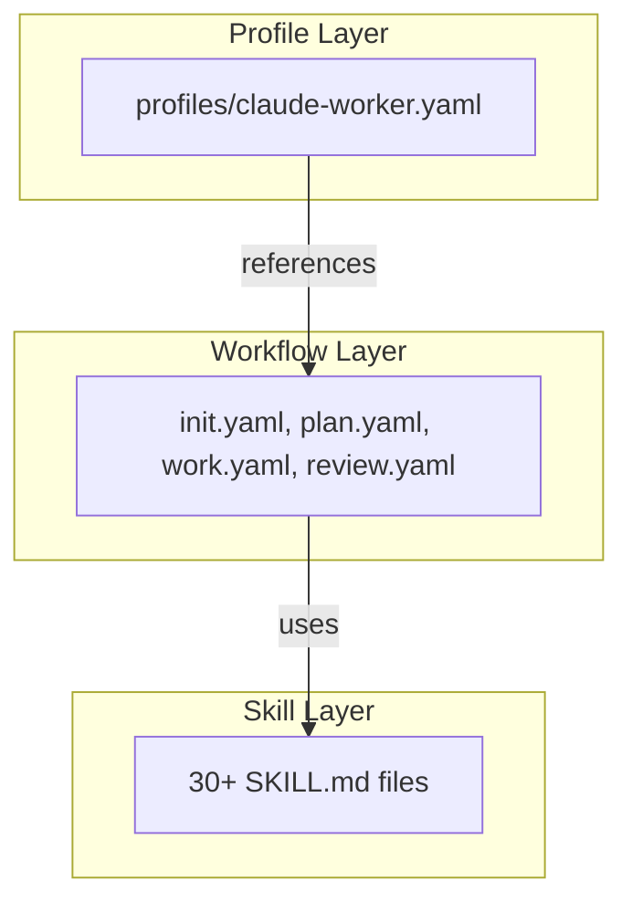

# Claude harness Architecture

## 1. Overview

`claude-code-harness` is a modular, autonomous development framework that maximizes the capabilities of Claude Code. The central design philosophy is to support a systematic development cycle — **Plan → Work → Review** — with three primary extensions: **Skills**, **Rules**, and **Hooks**.

## 2. Three-layer architecture

The plugin adopts the following three-layer architecture to maximize reusability and maintainability.



- **Skill Layer**: Self-contained knowledge units defined as `SKILL.md` files. Contains specific procedures and knowledge for executing particular tasks (e.g., security review, code implementation).
- **Workflow Layer**: Defined as `*.yaml` files, orchestrates **Skills** for executing specific development phases (e.g., `/work`). Manages step ordering, conditional branching, and error handling.
- **Profile Layer**: Defines the overall behavior of the plugin. Specifies which workflows are mapped to which commands and which skill categories are permitted.

## 3. Directory structure

```
claude-code-harness/
├── .claude-plugin/         # Plugin metadata
│   ├── plugin.json
│   └── hooks.json
├── skills/                 # Skill definitions (SKILL.md + references/)
│   ├── impl/               # Implementation skills
│   ├── harness-review/     # Review skills
│   ├── verify/             # Verification skills
│   ├── planning/           # Planning skills
│   ├── setup/              # Setup skills
│   ├── ci/                 # CI/CD related skills
│   └── ...                 # 30+ other skills
├── agents/                 # Sub-agent definitions (Markdown)
├── hooks/                  # Hook definitions (hooks.json)
├── scripts/                # Shell scripts for automation
├── docs/                   # Documentation
└── templates/              # Various templates
```

## 4. Key components

### 4.1. Skills

Each skill specifies `description` (when to use it) and `allowed-tools` (permitted tools), which supports Claude's autonomous discovery and safe execution.

### 4.2. Rules

Configuration files strictly defined in `claude-code-harness.config.schema.json` enforce safety (`dry-run` mode) and path restrictions (`protected` paths).

### 4.3. Hooks

Defined in `hooks.json`, hooks automatically execute scripts at key points in the development process.
- **SessionStart**: Environment checks at session start
- **PostToolUse**: Automatic tests and change tracking after file edits
- **Stop**: Summary generation at session end

### 4.4. Parallel processing

The `/harness-review` command launches multiple `code-reviewer` sub-agents simultaneously and runs security, performance, and quality reviews in parallel, significantly reducing feedback time.
